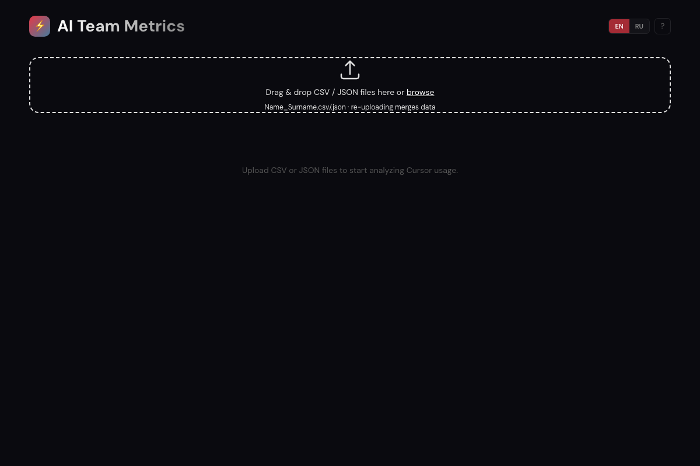

# AI Team Metrics

Analytics dashboard for tracking [Cursor IDE](https://cursor.com) usage across a development team. Built to measure AI adoption, compare individual patterns, and generate management reports.




## What it does

- **6 analytics tabs**: Overview, Adoption, Code Impact, Timeline, Models, Per Developer
- **Two data sources**: CSV (per-request usage) and JSON (extended API metrics: lines of code, accept rate, languages)
- **GitHub-style heatmaps**: daily activity and day×hour activity maps
- **PDF export**: multi-page report for management
- **Data backup**: export/import JSON snapshots to transfer data between machines
- **Chrome extension**: one-click data collection from cursor.com/dashboard
- **Incremental merge**: upload new data on top of existing — deduplication included
- **Bilingual UI**: English and Russian with one-click toggle
- **Keyboard shortcuts**: `1`-`6` switch tabs, `/` toggles uploader, `L` toggles language, `?` shows help
- **Local-only**: all data stays in your browser (localStorage), nothing is sent anywhere

## Quick start

```bash
git clone https://github.com/Samehadar/ai-team-metrics.git
cd ai-team-metrics
npm install
npm run dev
```

Open http://localhost:5173 and drag & drop CSV/JSON files into the upload area.

## Data collection

### Option 1: Manual export from Cursor

1. Log into [cursor.com/dashboard](https://cursor.com/dashboard)
2. Export your usage data (CSV or JSON)
3. Name files as `FirstName_LastName.csv` / `.json`
4. Upload to the dashboard

### Option 2: Chrome extension (recommended for teams)

The included Chrome extension automates data collection:

1. Open `chrome://extensions`, enable **Developer mode**
2. Click **Load unpacked**, select the `cursor-analytics-extension/` folder
3. Navigate to `cursor.com/dashboard` while logged into a team member's account
4. Click ⚡ button → download JSON and/or CSV

To configure the extension for your team, edit the `DEVS` array in `content-ui.js` and `EMAIL_MAP` in `popup.js` with your team members' Cursor account emails and names.

## Configuration

### Team roster

Edit `src/config/team.ts` to list your team members:

```typescript
export const TEAM: { name: string }[] = [
  { name: 'Alice Johnson' },
  { name: 'Bob Smith' },
  // ...
];
```

The roster is used to show all team members in the dashboard even if they haven't uploaded data yet.

## Project structure

```
ai-team-metrics/
├── src/
│   ├── components/          # React UI components
│   ├── i18n/                # Internationalization (EN/RU)
│   ├── utils/               # CSV/JSON parsing, aggregation, merge, storage
│   ├── config/              # Team roster configuration
│   ├── types/               # TypeScript interfaces
│   └── test/                # Unit tests (Vitest)
├── cursor-analytics-extension/  # Chrome extension for data collection
│   ├── manifest.json
│   ├── content.js           # API calls in cursor.com context
│   ├── content-ui.js        # ⚡ button on cursor.com/dashboard
│   └── popup.html/js/css    # Extension popup
└── public/                  # Static assets
```

## Dashboard tabs

**Overview** — KPI cards (developers, requests, tokens, avg/day) and per-developer bar charts.

**Adoption** — Week-over-week comparison, adoption rate trend, team segmentation (Power / Regular / Low / Inactive).

**Code Impact** — Lines added/deleted, accept rate, tab completion rate, language treemap. Requires JSON data.

**Timeline** — Stacked area charts, developer×date heatmap, day×hour heatmap (YouTube-style).

**Models** — Distribution pie chart, per-developer model breakdown.

**Per Developer** — Deep dive into individual usage: daily/hourly activity, trends with 7-day moving average, GitHub-style activity heatmap.

## Tests

```bash
npm test            # run once
npm run test:watch  # watch mode
npm run typecheck   # type check without emitting
```

105+ tests covering CSV/JSON parsing, data aggregation, merge logic, storage, formatters, and component smoke tests.

## Tech stack

- **Vite 8** + **React 19** + **TypeScript 5.9** — frontend
- **Tailwind CSS 4** — styling
- **Recharts 3** — charts (Bar, Area, Line, Pie, Composed, Treemap)
- **PapaParse** — CSV parsing
- **html2canvas-pro** + **jsPDF** — PDF report generation
- **Vitest** + **Testing Library** — unit and component tests
- **Chrome Extension (MV3)** — data collection

## File format

**CSV** — per-request export from Cursor:

```csv
Date,Kind,Model,Max Mode,Input (w/ Cache Write),Input (w/o Cache Write),Cache Read,Output Tokens,Total Tokens,Cost
"2026-03-16T10:57:01.747Z","Included","composer-1.5","No","0","85921","134176","3415","223512","Included"
```

**JSON** — extended analytics from Cursor API:

```json
{
  "dailyMetrics": [{
    "date": "1773360000000",
    "agentRequests": 89,
    "linesAdded": 4294,
    "linesDeleted": 1801,
    "modelUsage": [...]
  }]
}
```

## Contributing

Contributions are welcome! Please open an issue first to discuss what you'd like to change. Make sure all tests pass (`npm test`) and the type check succeeds (`npm run typecheck`) before submitting a PR.

## Privacy

This dashboard runs entirely in your browser. **No data is ever sent to any server.** All uploaded CSV/JSON files are processed client-side and stored in `localStorage`. The export/import feature creates local JSON files — nothing leaves your machine.

The Chrome extension only runs on `cursor.com` and communicates exclusively with Cursor's own API to fetch your usage data. It does not transmit data to any third-party service.

## License

MIT
